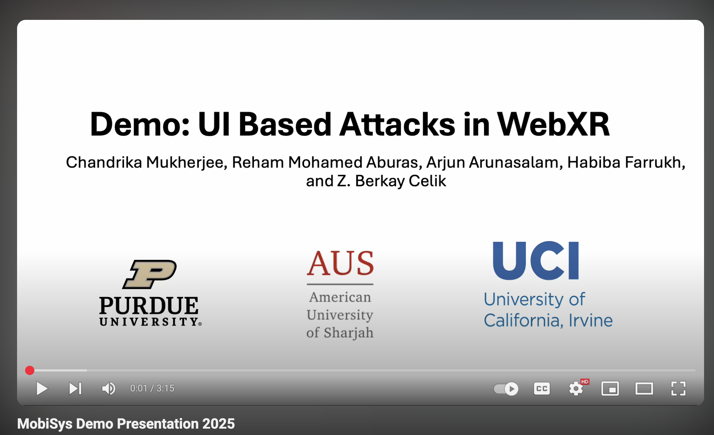

## 📚 Conference Proceedings

> Title: **Side-channel Inference of User Activities in AR/VR
> Using GPU Profiling**
>
> Authors: Seonghun Son, **Chandrika Mukherjee**, Reham Mohamed,  
> Berk Gulmezoglu, and Z. Berkay Celik
>
> Conference: NDSS, 2026  
> [Paper here](https://arxiv.org/abs/2509.10703){:target="\_blank"}

  

    
    <blockquote>
    
Title: <strong>Demo: UI Based Attacks in WebXR</strong>

    
Authors: <strong>Chandrika Mukherjee</strong>, Reham Mohamed, Arjun Arunasalam,
    Habiba Farrukh and Z. Berkay Celik

    
Conference: ACM MobiSys, 2025
     
    <a href="../files/2025_mobisys_demo.pdf" target="_blank">Paper here</a>,
    <a href="../files/mobisys_demo_poster_2025_final.pdf" target="_blank">Poster here</a>

    </blockquote>

  

  

    
     
    <a href="https://github.com/chandms/demo_app_webxr_main" target="_blank">
    GitHub Link-1, 
    </a>
    <a href="https://github.com/chandms/demo_app_webxr_other" target="_blank">
    GitHub Link-2
    </a>
     
    <a href="https://chandms.github.io/demo_app_webxr_main/controller_based.html" target="_blank">
    Live: Attacks in controller based and 
    </a>
    <a href="https://chandms.github.io/demo_app_webxr_main/gaze_based.html" target="_blank">
    Attacks in gaze based environment. 
    </a>
  

> Title: **Shadowed Realities: An Investigation of UI Attacks in WebXR**
>
> Authors: **Chandrika Mukherjee**, Reham Mohamed, Arjun Arunasalam,  
> Habiba Farrukh and Z. Berkay Celik
>
> Conference: USENIX Security Symposium, 2025 (Acceptance Rate: 17.1%)  
> Received **Honorable Mention Award 🏆**  
> [Paper here](https://www.usenix.org/conference/usenixsecurity25/presentation/mukherjee){:target="\_blank"}

## 📜 Workshop Papers

> Title: **Towards Secure User Interaction in WebXR**
>
> Authors: **Chandrika Mukherjee**, Arjun Arunasalam, Habiba Farrukh,  
> Reham Mohamed and Z. Berkay Celik
>
> Workshop: HumanSys @ SenSys, 2025  
> [Paper here](https://dl.acm.org/doi/10.1145/3722570.3726880){:target="\_blank"}  
> [Poster here](../files/humansys_poster_2025.pdf){:target="\_blank"}

> Title: **On designing a fast-deployable 'localized' GIS platform for using 'offline' during post-disaster situation**
>
> Authors: Partha Sarathi Paul, **Chandrika Mukherjee**, Bishakh Chandra Ghosh,  
> Sudipta Pandit, Sujoy Saha, and Subrata Nandi
>
> Workshop: EmeRTeS @ ICDCN, 2019  
> [Paper here](https://dl.acm.org/doi/pdf/10.1145/3288599.3295592){:target="\_blank"}
